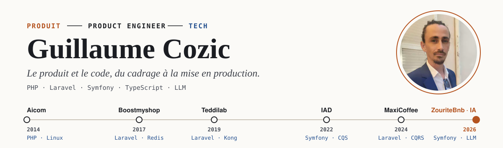
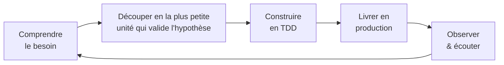

<picture>
  <source media="(prefers-color-scheme: dark)" srcset="assets/banner-dark.svg">
  
</picture>

  
  
  
  

Le Pradet (83) · Var · remote ou sur site

---

## Product Engineer, c'est quoi ?

> **Un Product Engineer est un développeur qui se sent responsable du résultat pour l'utilisateur, pas seulement du code livré.**
> Il comprend le besoin, participe à la décision de *quoi* construire, le construit de bout en bout, le met en production, observe l'usage réel — puis itère.

La différence avec un rôle de développeur « à la spec » tient en une question : *on a livré le ticket* ou *on a résolu le problème ?*

| | Développeur « à la spec » | Product Engineer |
|---|---|---|
| **Point de départ** | Un ticket rédigé par quelqu'un d'autre | Un problème utilisateur ou métier |
| **Question clé** | *Comment* le coder ? | *Pourquoi* le faire, et quelle est la plus petite unité qui valide l'hypothèse ? |
| **Périmètre** | Sa brique (back, front…) | De bout en bout : API, front, données, déploiement |
| **« Terminé » veut dire** | Mergé | En production, utilisé, mesuré |
| **Face au métier** | Exécute | Challenge, propose, arbitre la valeur contre le coût |

Pour tenir ce rôle sans s'épuiser, il faut un code qui accepte le changement : c'est là que l'architecture hexagonale et le TDD entrent en jeu.

---

## Ma façon de travailler

**01 · Challenger le besoin**
Cadrer avec le métier, questionner la valeur, puis **découper** : on cherche la plus petite unité livrable avec laquelle on est capable de valider l'hypothèse du besoin. On livre, on observe, et seulement ensuite on décide d'aller plus loin. Chez IAD, j'ai identifié que des règles d'éligibilité appartenaient à l'équipe Mandats et je les ai redirigées vers elle, plutôt que de laisser fuir du contexte métier dans notre code.

**02 · Livrer sans dette**
Architecture hexagonale + TDD, assisté par l'IA (Claude Code) : le domaine reste pur, les détails techniques sont des adapters, et un pivot produit ne casse pas tout.

**03 · Itérer**
Transformer chaque retour utilisateur en évolution, vite et en confiance — les tests sont le filet qui rend la vitesse possible.

---

## Projets phares

### ZouriteBnb — marketplace de location de logements
[Code](https://github.com/guillaume-cozic/zouritebnb) · [www.zouritebnb.com](https://www.zouritebnb.com) · projet personnel, 2026, en préproduction

Une plateforme type Airbnb pour l'île Rodrigues, conçue et développée seul, du modèle métier au déploiement.

| Produit — le pourquoi | Tech — le comment |
|---|---|
| Recherche sur carte avec filtres et dates | PHP 8.4 · Symfony · API Platform en architecture hexagonale |
| Réservation sur demande ou instantanée, calendrier de disponibilité | React 19 · Redux Toolkit · TypeScript · Vite |
| Paiement Stripe, annulation avec politique de remboursement | Tests unitaires, d'intégration, E2E et **de contrat OpenAPI** entre API et front |
| Avis croisés, messagerie, wishlist, co-hôtes | Tests de mutation (Infection), règles d'architecture (PHPArkitect) |
| Back-office admin, blog | Docker, déploiement Ansible, Symfony Messenger, JWT |

### Assistant conversationnel LLM — piloter un site par le chat
Projet personnel, 2026 · code privé

Un chat en langage naturel qui recherche et réserve un logement sur un site cible, via un LLM et des outils exposés en MCP.

| Produit — le pourquoi | Tech — le comment |
|---|---|
| Réserver sans quitter la conversation | Orchestrateur NestJS (Fastify) en architecture hexagonale, LangGraph |
| Brancher n'importe quel site sans toucher au cœur | Serveur MCP générique + « domain packs » (prompt, outils, guide) |
| Ne pas dépendre d'un fournisseur de LLM | Claude Agent SDK pour le POC, Ollama / vLLM auto-hébergé en cible — un simple adapter |
| Savoir si une nouvelle version répond mieux | Traces Langfuse, scoring LLM-as-judge, comparaison de runs d'évaluation |

---

## Stack

| | |
|---|---|
| **Back** | PHP 8 · Laravel · Symfony · API Platform · NestJS |
| **Front** | React · Redux · TypeScript |
| **Data** | PostgreSQL · MySQL · Elasticsearch · Redis |
| **Ops** | Docker · Ansible · Kong · GitHub Actions · Jenkins |
| **IA** | Claude Code · Claude Agent SDK · LangGraph · MCP · Langfuse |
| **Méthodes** | TDD · DDD · CQRS · architecture hexagonale |

---

## Parcours

| Période | Où | Côté produit | Côté tech |
|---|---|---|---|
| 2024 → auj. | **MaxiCoffee** | Onboarding / offboarding salariés automatisé, référentiel des sites, déclaration de pannes | Laravel, monolithe modulaire, CQRS, TDD |
| 2022 → 2023 | **IAD** | Diffusion d'annonces immobilières (Le Bon Coin, SeLoger) | Symfony, hexagonal + CQS à côté d'un legacy PHP 5.3, exports +20 à 30 % |
| 2019 → 2022 | **Teddilab** | E-learning aéronautique : licences, facturation, paiements | Laravel, bulle TDD sur un legacy sans tests, Kong, Elasticsearch |
| 2017 → 2018 | **Boostmyshop** | Repricing e-commerce, 40 M d'opérations par semaine | Lead technique, migration Laravel 4.2 → 5.6, DDD, CQRS |
| 2014 → 2017 | **Aicom** | 8 sites en production, 1,2 M de contacts emailing | Responsable technique, équipe de 3, 10 serveurs Linux |

Missions freelance : WellSail (NestJS, TDD outside-in), infosci (rapprochement bancaire), LMS indépendant (Ansible, CI/CD), formateur Laravel pour la Marine nationale.

Ingénieur informatique — ISEN Toulon (2008 – 2013).
